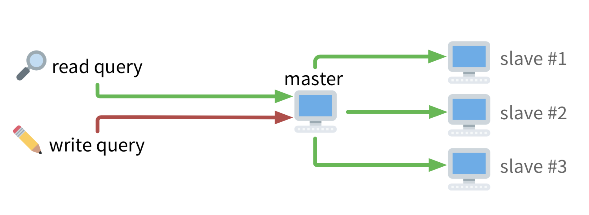
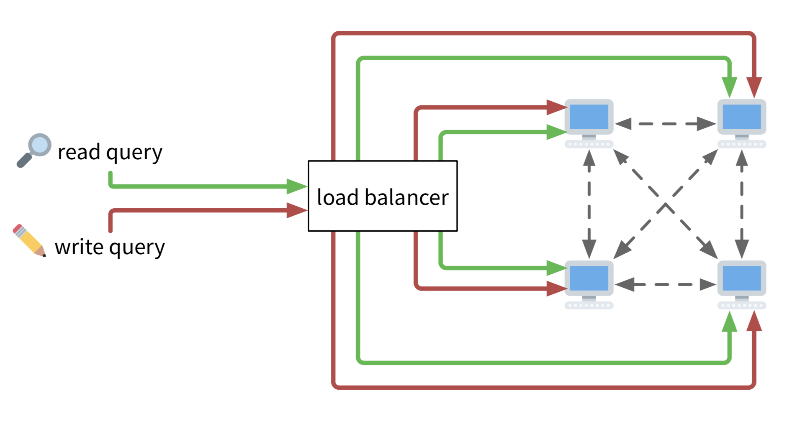
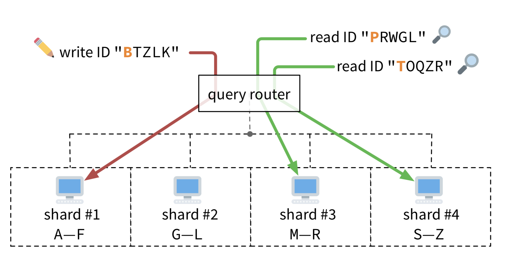
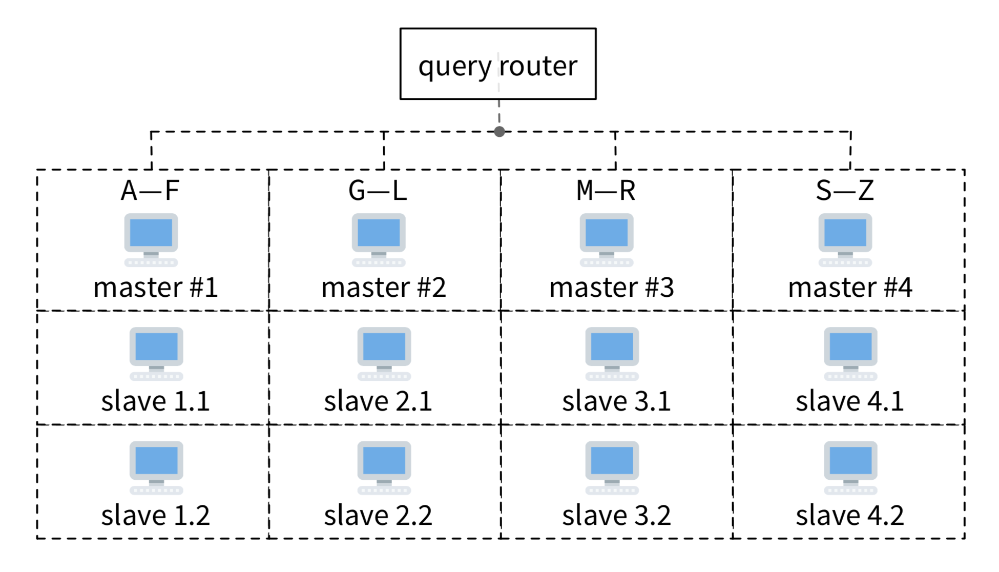

# Distributed Database

There are several situations in which not one, but several computers must act in coordination to provide a database system.

* Databases of several hundred terabytes. Finding a single computer with that much storage space is impractical.

* Database systems that process several thousand simultaneous queries per second. No single computer has enough networking or processing power to handle such a load.

* Mission-critical databases, such as the ones recording the altitude and speed of the aircraft currently in a given airspace. Relying on a single computer is too risky; if it crashes, the database becomes unavailable.

For these scenarios, there are DBMSs that can run on several coordinated computers forming a distributed database system.

## Common ways to set up a distributed database.

### Single-Master Replication

One computer is the master and receives all queries to the database. It is connected to several other slave computers. Each slave has a replica of the database. As the master receives write queries, it forwards them to slaves, keeping them synchronized:

With this setup, the master is able to serve more read queries, because it can delegate to those slaves. The system becomes more reliable: if the master computer shuts down, the slave machines can coordinate and elect a new master automatically. That way, the system doesn't stop running.

### Multi-Master Replication

If your database system must support a massive amount of simultaneous write queries, a single master cannot handle all the load. In this case, all computers in the cluster become masters. A load balancer is used to distribute incoming read and write queries equally among the machines in the cluster.

Each computer is connected to all others in the cluster. They propagate write queries among themselves, so they all remain synchronized. Each has a copy of the entire database.

### Sharding

If your database receives many write queries for large amounts of data, it’s hard to synchronize the database everywhere in the cluster. Some computers might not have enough storage space to accommodate the entire thing.

One solution is to partition the database among the computers. Since each machine owns a portion of the database, a query router forwards queries to the relevant one:

This setup can process many read and write queries for super huge databases. But it has a problem: if a machine in the cluster fails, the parts of data it is responsible for become unavailable. To mitigate that risk, sharding can be used with replication:

With this setup, each shard is served by a master-slave cluster. This further increases the database system capacity to serve read queries. And if one of the main servers in a shard goes offline, a slave can automatically take its place, ensuring the system doesn’t break down or lose data.
