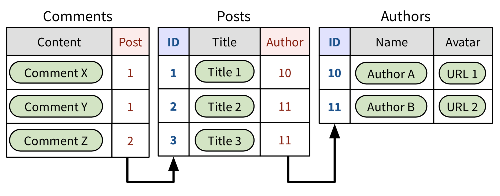
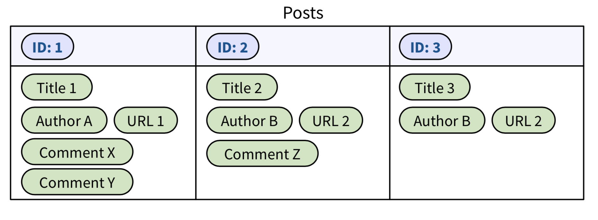

# Document Stores

This is the most widely known type of NoSQL database. In document stores, data entries are kept exactly the way they are needed by the application.

There are no “tables” and “rows” in document stores. Instead, a data entry is called a **document**. Related documents are grouped in a **collection**.

## Relational vs NoSQL

Relational | NoSQL
---------- | -----
 | 

The NoSQL database expects us to duplicate information at each relevant place. It’s hard to keep duplicated data updated and consistent. In return, by grouping relevant data together, document stores can offer more flexibility:

* You don't need to join rows
* You don't need fixed schemas
* Each data enty can have it's own configuration of fields
