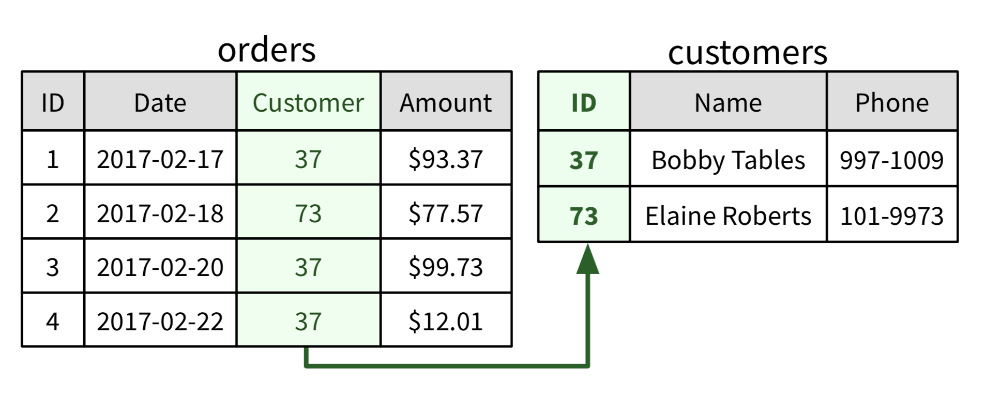

# Relational Databases

In the relational model, data is divided in different tables. A table works like a matrix or spreadsheet.

* Each data entry is a **row** in it.

* **Columns** are the different properties data entries can have. Columns are most commonly referred to as **fields**.

The organization of a database table is given by its fields and the restrictions they enforce. This combination of fields and restrictions is called the table’s **schema**. The database system won’t accept a row into a table if it violates the table’s schema.

## Relationships

Duplicated information is hard to manage and update. Relational databases make it easy to avoid duplicate information and data inconsistencies. The “relational” part of the term “relational database” comes from relationships defined between the database’s tables.

To support relationships, every table has a special identification field or `ID`. We use `ID` values to refer to specific rows within a table. These values must be unique: there can’t be two rows with the same ID. The `ID` field of a table is also known as its **primary key**. A field that records references to other rows’ `ID`s is called a **foreign key**.

One particularly useful kind of relationship is a foreign key relationship.



### Normalization

When a database is organized in a way that it is completely free of duplicate information, we say that the database is **normalized**. The process of transforming a database with replicated data to one without is called **normalization**.

### Schema Migration

As an application grows and new features are added, it’s unlikely its database structure (the **schema** of all its tables) remains the same. When we need to change the database structure, we create a **schema migration script**.

It automatically upgrades the schema and transforms existing data accordingly. Typically, these scripts can also undo their changes. This allows to easily restore the database structure to match a past working version of the software.

### Indexing

For a table’s primary key to be useful, we must be able to quickly retrieve a data entry when given its ID value. Database Indexing is a technique that DBMSs employ which map row `ID`s to their respective addresses in memory to facilitate fast retrieval.

An index is essentially a self-balancing binary search tree. Searching a binary search tree is `O(log n)`, so finding registers in large tables is fast.

### SQL

Almost every relational DBMS works with a query language called **SQL** (Structured Query Language). An SQL query is a statement of what data should be retrieved.

```SQL
SELECT <field name> [, <field name>, <field name>,...]
FROM <table name>
WHERE <condition>;
```

The items that come after `SELECT` are the fields you want to get. To get all the fields in the table, you can write `SELECT *`.

There can be several tables in the database, so `FROM` states which table you want to query.

After the `WHERE` command, you state the criteria for selecting rows. Boolean logic can be used to specify multiple conditions. For example, this query gets all fields from a `customers` table, filtering out rows by `name` and `age` fields:

```SQL
SELECT * FROM customers
WHERE name='John' AND age > 21;
```

Examples of Relational DBMSs include: `PostgreSQL, MySQL` and `Sqlite`.